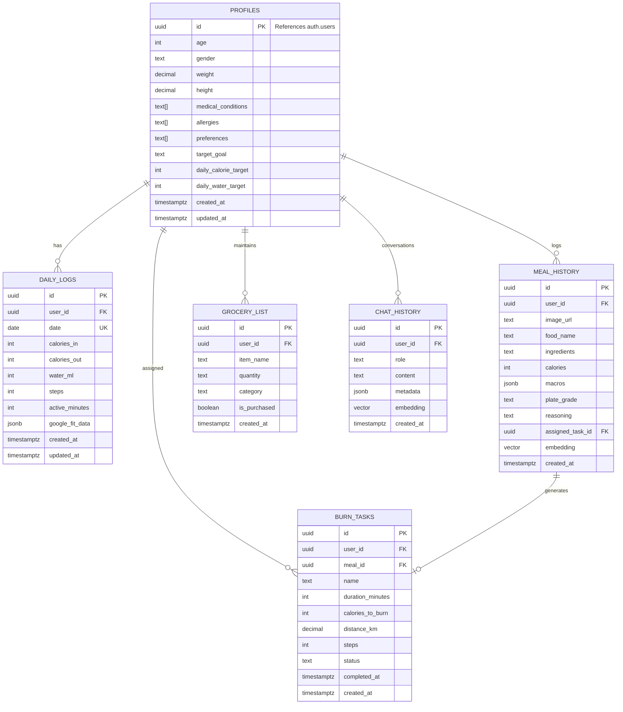
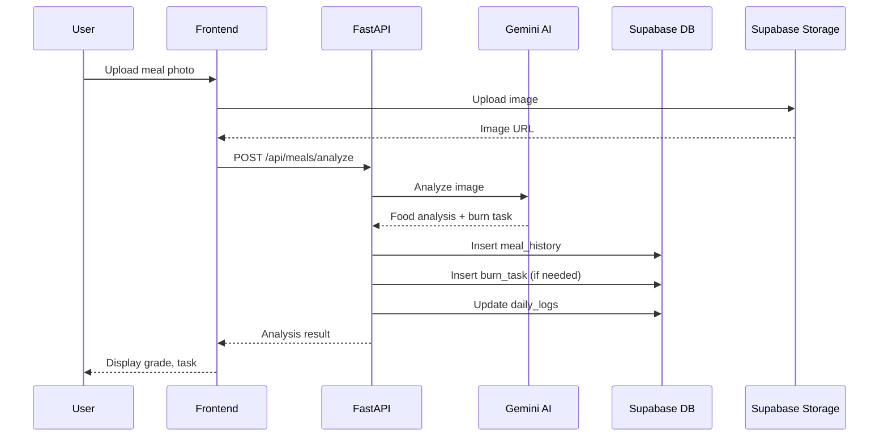
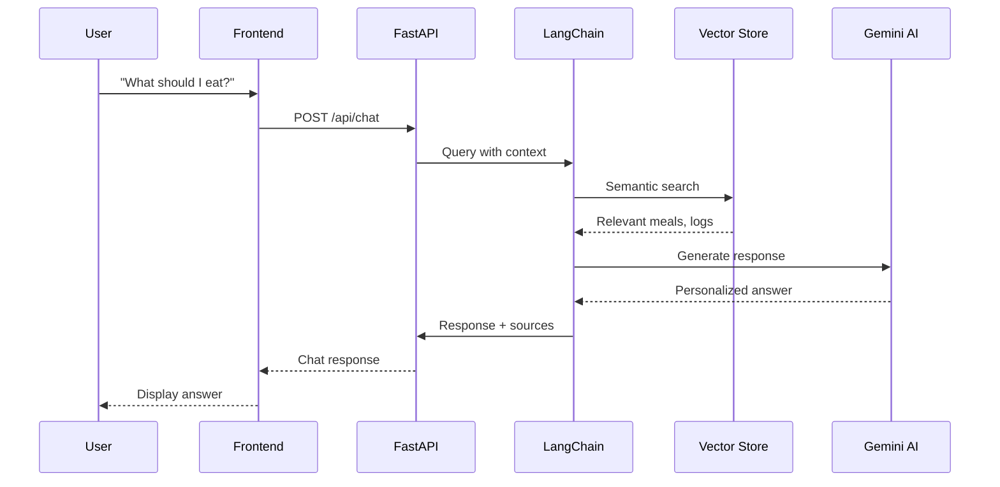

# FitFlow AI - Database Architecture

This document defines the complete database schema, relationships, and configurations for FitFlow AI using **Supabase (PostgreSQL)**.

---

## Entity Relationship Diagram



---

## Table Definitions

### 1. `profiles`

Stores user identity, health metrics, and preferences.

| Column | Type | Constraints | Description |
|--------|------|-------------|-------------|
| `id` | `UUID` | PRIMARY KEY, REFERENCES `auth.users(id)` | User ID from Supabase Auth |
| `age` | `INTEGER` | CHECK (age > 0 AND age < 150) | User's age in years |
| `gender` | `TEXT` | CHECK (gender IN ('male', 'female', 'other')) | Gender for calorie calculations |
| `weight` | `DECIMAL(5,2)` | CHECK (weight > 0) | Weight in kg |
| `height` | `DECIMAL(5,2)` | CHECK (height > 0) | Height in cm |
| `medical_conditions` | `TEXT[]` | DEFAULT '{}' | Array of conditions (e.g., 'Diabetes', 'Hypertension') |
| `allergies` | `TEXT[]` | DEFAULT '{}' | Food allergies (e.g., 'Peanuts', 'Shellfish') |
| `preferences` | `TEXT[]` | DEFAULT '{}' | Dietary preferences (e.g., 'Vegan', 'Keto') |
| `target_goal` | `TEXT` | CHECK (target_goal IN ('Weight Loss', 'Muscle Gain', 'Maintenance')) | User's fitness goal |
| `daily_calorie_target` | `INTEGER` | DEFAULT 2000 | Calculated daily calorie target |
| `daily_water_target` | `INTEGER` | DEFAULT 2500 | Daily water intake target in ml |
| `notification_enabled` | `BOOLEAN` | DEFAULT true | Push notification preference |
| `created_at` | `TIMESTAMPTZ` | DEFAULT NOW() | Record creation timestamp |
| `updated_at` | `TIMESTAMPTZ` | DEFAULT NOW() | Last update timestamp |

**Indexes:**
- Primary Key on `id`

---

### 2. `daily_logs`

Stores aggregated daily health metrics.

| Column | Type | Constraints | Description |
|--------|------|-------------|-------------|
| `id` | `UUID` | PRIMARY KEY, DEFAULT `gen_random_uuid()` | Unique log ID |
| `user_id` | `UUID` | REFERENCES `profiles(id)` ON DELETE CASCADE | Owner of the log |
| `date` | `DATE` | NOT NULL | Date of the log entry |
| `calories_in` | `INTEGER` | DEFAULT 0, CHECK (calories_in >= 0) | Total calories consumed |
| `calories_out` | `INTEGER` | DEFAULT 0, CHECK (calories_out >= 0) | Total calories burned |
| `water_ml` | `INTEGER` | DEFAULT 0, CHECK (water_ml >= 0) | Water intake in milliliters |
| `steps` | `INTEGER` | DEFAULT 0, CHECK (steps >= 0) | Steps from Google Fit |
| `active_minutes` | `INTEGER` | DEFAULT 0 | Active minutes from Google Fit |
| `google_fit_data` | `JSONB` | DEFAULT '{}' | Raw Google Fit sync data |
| `created_at` | `TIMESTAMPTZ` | DEFAULT NOW() | Record creation timestamp |
| `updated_at` | `TIMESTAMPTZ` | DEFAULT NOW() | Last update timestamp |

**Indexes:**
- Primary Key on `id`
- Unique constraint on (`user_id`, `date`)
- Index on (`user_id`, `date` DESC) for fast daily lookups

---

### 3. `meal_history`

Detailed log of every meal with AI analysis.

| Column | Type | Constraints | Description |
|--------|------|-------------|-------------|
| `id` | `UUID` | PRIMARY KEY, DEFAULT `gen_random_uuid()` | Unique meal ID |
| `user_id` | `UUID` | REFERENCES `profiles(id)` ON DELETE CASCADE | Owner of the meal |
| `image_url` | `TEXT` | NULL | Supabase Storage URL of meal photo |
| `image_hash` | `TEXT` | NULL | Hash for duplicate detection |
| `food_name` | `TEXT` | NOT NULL | AI-identified food name |
| `ingredients` | `TEXT` | NULL | Detected ingredients |
| `calories` | `INTEGER` | CHECK (calories >= 0) | Estimated calories |
| `macros` | `JSONB` | NOT NULL | `{p: protein_g, c: carbs_g, f: fat_g, fiber: fiber_g}` |
| `plate_grade` | `TEXT` | CHECK (plate_grade IN ('A+', 'A', 'B+', 'B', 'C+', 'C', 'D+', 'D', 'F')) | Health grade |
| `reasoning` | `TEXT` | NULL | AI reasoning for the grade |
| `assigned_task_id` | `UUID` | REFERENCES `burn_tasks(id)` | Linked burn task if any |
| `source` | `TEXT` | DEFAULT 'photo' CHECK (source IN ('photo', 'text', 'voice')) | How meal was logged |
| `embedding` | `VECTOR(768)` | NULL | For RAG similarity search |
| `created_at` | `TIMESTAMPTZ` | DEFAULT NOW() | When meal was logged |

**Indexes:**
- Primary Key on `id`
- Index on (`user_id`, `created_at` DESC) for history queries
- IVFFlat index on `embedding` for vector similarity search
- Index on `image_hash` for duplicate detection

---

### 4. `burn_tasks`

Tasks assigned to users to burn off excess calories.

| Column | Type | Constraints | Description |
|--------|------|-------------|-------------|
| `id` | `UUID` | PRIMARY KEY, DEFAULT `gen_random_uuid()` | Unique task ID |
| `user_id` | `UUID` | REFERENCES `profiles(id)` ON DELETE CASCADE | Task owner |
| `meal_id` | `UUID` | REFERENCES `meal_history(id)` ON DELETE SET NULL | Meal that triggered task |
| `name` | `TEXT` | NOT NULL | Exercise name (walk, run, jump, etc.) |
| `duration_minutes` | `INTEGER` | CHECK (duration_minutes > 0) | Duration in minutes |
| `calories_to_burn` | `INTEGER` | CHECK (calories_to_burn > 0) | Target calories to burn |
| `distance_km` | `DECIMAL(5,2)` | NULL | Distance in km (for walking/running) |
| `steps` | `INTEGER` | NULL | Target steps (for walking) |
| `status` | `TEXT` | DEFAULT 'pending' CHECK (status IN ('pending', 'in_progress', 'completed', 'skipped')) | Task status |
| `completed_at` | `TIMESTAMPTZ` | NULL | When task was completed |
| `due_by` | `TIMESTAMPTZ` | NULL | Deadline for the task |
| `created_at` | `TIMESTAMPTZ` | DEFAULT NOW() | When task was created |

**Indexes:**
- Primary Key on `id`
- Index on (`user_id`, `status`, `created_at` DESC)

---

### 5. `grocery_list`

Smart shopping list generated from AI suggestions.

| Column | Type | Constraints | Description |
|--------|------|-------------|-------------|
| `id` | `UUID` | PRIMARY KEY, DEFAULT `gen_random_uuid()` | Unique item ID |
| `user_id` | `UUID` | REFERENCES `profiles(id)` ON DELETE CASCADE | List owner |
| `item_name` | `TEXT` | NOT NULL | Item name |
| `quantity` | `TEXT` | NULL | Quantity (e.g., "500g", "2 pieces") |
| `category` | `TEXT` | DEFAULT 'other' | Category (produce, dairy, protein, etc.) |
| `suggested_by_ai` | `BOOLEAN` | DEFAULT false | If AI suggested this item |
| `recipe_context` | `TEXT` | NULL | Which recipe needs this item |
| `is_purchased` | `BOOLEAN` | DEFAULT false | Check-off status |
| `created_at` | `TIMESTAMPTZ` | DEFAULT NOW() | When item was added |

**Indexes:**
- Primary Key on `id`
- Index on (`user_id`, `is_purchased`)

---

### 6. `chat_history`

Stores Fit Buddy conversation history for RAG context.

| Column | Type | Constraints | Description |
|--------|------|-------------|-------------|
| `id` | `UUID` | PRIMARY KEY, DEFAULT `gen_random_uuid()` | Message ID |
| `user_id` | `UUID` | REFERENCES `profiles(id)` ON DELETE CASCADE | Conversation owner |
| `session_id` | `UUID` | NULL | For grouping conversations |
| `role` | `TEXT` | CHECK (role IN ('user', 'assistant', 'system')) | Message role |
| `content` | `TEXT` | NOT NULL | Message content |
| `metadata` | `JSONB` | DEFAULT '{}' | Extra data (tokens used, etc.) |
| `embedding` | `VECTOR(768)` | NULL | For semantic search |
| `created_at` | `TIMESTAMPTZ` | DEFAULT NOW() | Message timestamp |

**Indexes:**
- Primary Key on `id`
- Index on (`user_id`, `session_id`, `created_at`)
- IVFFlat index on `embedding`

---

## Complete SQL Schema

```sql
-- ============================================
-- FitFlow AI Database Schema
-- Supabase PostgreSQL
-- ============================================

-- Enable required extensions
CREATE EXTENSION IF NOT EXISTS vector;
CREATE EXTENSION IF NOT EXISTS pg_trgm;

-- ============================================
-- 1. PROFILES TABLE
-- ============================================
CREATE TABLE profiles (
    id UUID PRIMARY KEY REFERENCES auth.users(id) ON DELETE CASCADE,
    age INTEGER CHECK (age > 0 AND age < 150),
    gender TEXT CHECK (gender IN ('male', 'female', 'other')),
    weight DECIMAL(5,2) CHECK (weight > 0),
    height DECIMAL(5,2) CHECK (height > 0),
    medical_conditions TEXT[] DEFAULT '{}',
    allergies TEXT[] DEFAULT '{}',
    preferences TEXT[] DEFAULT '{}',
    target_goal TEXT CHECK (target_goal IN ('Weight Loss', 'Muscle Gain', 'Maintenance')),
    daily_calorie_target INTEGER DEFAULT 2000,
    daily_water_target INTEGER DEFAULT 2500,
    notification_enabled BOOLEAN DEFAULT true,
    created_at TIMESTAMPTZ DEFAULT NOW(),
    updated_at TIMESTAMPTZ DEFAULT NOW()
);

-- ============================================
-- 2. DAILY_LOGS TABLE
-- ============================================
CREATE TABLE daily_logs (
    id UUID PRIMARY KEY DEFAULT gen_random_uuid(),
    user_id UUID REFERENCES profiles(id) ON DELETE CASCADE,
    date DATE NOT NULL,
    calories_in INTEGER DEFAULT 0 CHECK (calories_in >= 0),
    calories_out INTEGER DEFAULT 0 CHECK (calories_out >= 0),
    water_ml INTEGER DEFAULT 0 CHECK (water_ml >= 0),
    steps INTEGER DEFAULT 0 CHECK (steps >= 0),
    active_minutes INTEGER DEFAULT 0,
    google_fit_data JSONB DEFAULT '{}',
    created_at TIMESTAMPTZ DEFAULT NOW(),
    updated_at TIMESTAMPTZ DEFAULT NOW(),
    UNIQUE(user_id, date)
);

CREATE INDEX idx_daily_logs_user_date ON daily_logs(user_id, date DESC);

-- ============================================
-- 3. BURN_TASKS TABLE (create first for FK)
-- ============================================
CREATE TABLE burn_tasks (
    id UUID PRIMARY KEY DEFAULT gen_random_uuid(),
    user_id UUID REFERENCES profiles(id) ON DELETE CASCADE,
    meal_id UUID, -- Will add FK after meal_history exists
    name TEXT NOT NULL,
    duration_minutes INTEGER CHECK (duration_minutes > 0),
    calories_to_burn INTEGER CHECK (calories_to_burn > 0),
    distance_km DECIMAL(5,2),
    steps INTEGER,
    status TEXT DEFAULT 'pending' CHECK (status IN ('pending', 'in_progress', 'completed', 'skipped')),
    completed_at TIMESTAMPTZ,
    due_by TIMESTAMPTZ,
    created_at TIMESTAMPTZ DEFAULT NOW()
);

CREATE INDEX idx_burn_tasks_user_status ON burn_tasks(user_id, status, created_at DESC);

-- ============================================
-- 4. MEAL_HISTORY TABLE
-- ============================================
CREATE TABLE meal_history (
    id UUID PRIMARY KEY DEFAULT gen_random_uuid(),
    user_id UUID REFERENCES profiles(id) ON DELETE CASCADE,
    image_url TEXT,
    image_hash TEXT,
    food_name TEXT NOT NULL,
    ingredients TEXT,
    calories INTEGER CHECK (calories >= 0),
    macros JSONB NOT NULL DEFAULT '{"p": 0, "c": 0, "f": 0}',
    plate_grade TEXT CHECK (plate_grade IN ('A+', 'A', 'B+', 'B', 'C+', 'C', 'D+', 'D', 'F')),
    reasoning TEXT,
    assigned_task_id UUID REFERENCES burn_tasks(id) ON DELETE SET NULL,
    source TEXT DEFAULT 'photo' CHECK (source IN ('photo', 'text', 'voice')),
    embedding VECTOR(768),
    created_at TIMESTAMPTZ DEFAULT NOW()
);

CREATE INDEX idx_meal_history_user_date ON meal_history(user_id, created_at DESC);
CREATE INDEX idx_meal_history_image_hash ON meal_history(image_hash) WHERE image_hash IS NOT NULL;
CREATE INDEX idx_meal_history_embedding ON meal_history USING ivfflat (embedding vector_cosine_ops) WITH (lists = 100);

-- Add FK from burn_tasks to meal_history
ALTER TABLE burn_tasks ADD CONSTRAINT fk_burn_tasks_meal 
    FOREIGN KEY (meal_id) REFERENCES meal_history(id) ON DELETE SET NULL;

-- ============================================
-- 5. GROCERY_LIST TABLE
-- ============================================
CREATE TABLE grocery_list (
    id UUID PRIMARY KEY DEFAULT gen_random_uuid(),
    user_id UUID REFERENCES profiles(id) ON DELETE CASCADE,
    item_name TEXT NOT NULL,
    quantity TEXT,
    category TEXT DEFAULT 'other',
    suggested_by_ai BOOLEAN DEFAULT false,
    recipe_context TEXT,
    is_purchased BOOLEAN DEFAULT false,
    created_at TIMESTAMPTZ DEFAULT NOW()
);

CREATE INDEX idx_grocery_list_user ON grocery_list(user_id, is_purchased);

-- ============================================
-- 6. CHAT_HISTORY TABLE
-- ============================================
CREATE TABLE chat_history (
    id UUID PRIMARY KEY DEFAULT gen_random_uuid(),
    user_id UUID REFERENCES profiles(id) ON DELETE CASCADE,
    session_id UUID,
    role TEXT CHECK (role IN ('user', 'assistant', 'system')),
    content TEXT NOT NULL,
    metadata JSONB DEFAULT '{}',
    embedding VECTOR(768),
    created_at TIMESTAMPTZ DEFAULT NOW()
);

CREATE INDEX idx_chat_history_user_session ON chat_history(user_id, session_id, created_at);
CREATE INDEX idx_chat_history_embedding ON chat_history USING ivfflat (embedding vector_cosine_ops) WITH (lists = 100);

-- ============================================
-- ROW LEVEL SECURITY (RLS)
-- ============================================
ALTER TABLE profiles ENABLE ROW LEVEL SECURITY;
ALTER TABLE daily_logs ENABLE ROW LEVEL SECURITY;
ALTER TABLE meal_history ENABLE ROW LEVEL SECURITY;
ALTER TABLE burn_tasks ENABLE ROW LEVEL SECURITY;
ALTER TABLE grocery_list ENABLE ROW LEVEL SECURITY;
ALTER TABLE chat_history ENABLE ROW LEVEL SECURITY;

-- Profiles policies
CREATE POLICY "Users can view own profile" 
    ON profiles FOR SELECT USING (auth.uid() = id);
CREATE POLICY "Users can update own profile" 
    ON profiles FOR UPDATE USING (auth.uid() = id);
CREATE POLICY "Users can insert own profile" 
    ON profiles FOR INSERT WITH CHECK (auth.uid() = id);

-- Daily logs policies
CREATE POLICY "Users can manage own daily logs" 
    ON daily_logs FOR ALL USING (auth.uid() = user_id);

-- Meal history policies
CREATE POLICY "Users can manage own meals" 
    ON meal_history FOR ALL USING (auth.uid() = user_id);

-- Burn tasks policies
CREATE POLICY "Users can manage own tasks" 
    ON burn_tasks FOR ALL USING (auth.uid() = user_id);

-- Grocery list policies
CREATE POLICY "Users can manage own grocery list" 
    ON grocery_list FOR ALL USING (auth.uid() = user_id);

-- Chat history policies
CREATE POLICY "Users can manage own chat history" 
    ON chat_history FOR ALL USING (auth.uid() = user_id);

-- ============================================
-- FUNCTIONS & TRIGGERS
-- ============================================

-- Auto-update updated_at timestamp
CREATE OR REPLACE FUNCTION update_updated_at()
RETURNS TRIGGER AS $$
BEGIN
    NEW.updated_at = NOW();
    RETURN NEW;
END;
$$ LANGUAGE plpgsql;

CREATE TRIGGER profiles_updated_at
    BEFORE UPDATE ON profiles
    FOR EACH ROW EXECUTE FUNCTION update_updated_at();

CREATE TRIGGER daily_logs_updated_at
    BEFORE UPDATE ON daily_logs
    FOR EACH ROW EXECUTE FUNCTION update_updated_at();

-- Auto-create profile on user signup
CREATE OR REPLACE FUNCTION handle_new_user()
RETURNS TRIGGER AS $$
BEGIN
    INSERT INTO profiles (id)
    VALUES (NEW.id);
    RETURN NEW;
END;
$$ LANGUAGE plpgsql SECURITY DEFINER;

CREATE TRIGGER on_auth_user_created
    AFTER INSERT ON auth.users
    FOR EACH ROW EXECUTE FUNCTION handle_new_user();

-- Function to get or create today's daily log
CREATE OR REPLACE FUNCTION get_or_create_daily_log(p_user_id UUID)
RETURNS UUID AS $$
DECLARE
    v_log_id UUID;
BEGIN
    SELECT id INTO v_log_id
    FROM daily_logs
    WHERE user_id = p_user_id AND date = CURRENT_DATE;
    
    IF v_log_id IS NULL THEN
        INSERT INTO daily_logs (user_id, date)
        VALUES (p_user_id, CURRENT_DATE)
        RETURNING id INTO v_log_id;
    END IF;
    
    RETURN v_log_id;
END;
$$ LANGUAGE plpgsql SECURITY DEFINER;

-- Function to update daily calories when meal is added
CREATE OR REPLACE FUNCTION update_daily_calories_on_meal()
RETURNS TRIGGER AS $$
BEGIN
    -- Get or create today's log
    PERFORM get_or_create_daily_log(NEW.user_id);
    
    -- Update calories_in
    UPDATE daily_logs
    SET calories_in = calories_in + COALESCE(NEW.calories, 0),
        updated_at = NOW()
    WHERE user_id = NEW.user_id AND date = CURRENT_DATE;
    
    RETURN NEW;
END;
$$ LANGUAGE plpgsql SECURITY DEFINER;

CREATE TRIGGER meal_added_update_daily
    AFTER INSERT ON meal_history
    FOR EACH ROW EXECUTE FUNCTION update_daily_calories_on_meal();

-- ============================================
-- STORAGE BUCKETS (Run via Supabase Dashboard)
-- ============================================
-- Create bucket: meal-images (public: false)
-- Create bucket: pantry-images (public: false)
-- Create bucket: menu-images (public: false)

-- Storage policies (example for meal-images)
-- INSERT: Allow authenticated users to upload to their folder
-- SELECT: Allow users to view their own images
-- DELETE: Allow users to delete their own images
```

---

## Supabase Storage Configuration

### Buckets to Create

| Bucket Name | Public | Purpose |
|-------------|--------|---------|
| `meal-images` | No | Store meal photos |
| `pantry-images` | No | Store pantry/fridge photos |
| `menu-images` | No | Store restaurant menu photos |

### Storage Policies

```sql
-- Policy: Users can upload to their own folder
CREATE POLICY "Users can upload own images"
ON storage.objects FOR INSERT
WITH CHECK (
    bucket_id = 'meal-images' AND
    auth.uid()::text = (storage.foldername(name))[1]
);

-- Policy: Users can view their own images
CREATE POLICY "Users can view own images"
ON storage.objects FOR SELECT
USING (
    bucket_id = 'meal-images' AND
    auth.uid()::text = (storage.foldername(name))[1]
);

-- Policy: Users can delete their own images
CREATE POLICY "Users can delete own images"
ON storage.objects FOR DELETE
USING (
    bucket_id = 'meal-images' AND
    auth.uid()::text = (storage.foldername(name))[1]
);
```

---

## Data Flow Diagrams

### Meal Logging Flow



### RAG Chat Flow



---

## Query Examples

### Get Today's Dashboard Data

```sql
SELECT 
    p.daily_calorie_target,
    p.daily_water_target,
    dl.calories_in,
    dl.calories_out,
    dl.water_ml,
    dl.steps,
    (SELECT COUNT(*) FROM burn_tasks bt WHERE bt.user_id = p.id AND bt.status = 'pending') as pending_tasks
FROM profiles p
LEFT JOIN daily_logs dl ON dl.user_id = p.id AND dl.date = CURRENT_DATE
WHERE p.id = $1;
```

### Get Recent Meals with Tasks

```sql
SELECT 
    mh.*,
    bt.name as task_name,
    bt.duration_minutes,
    bt.status as task_status
FROM meal_history mh
LEFT JOIN burn_tasks bt ON bt.id = mh.assigned_task_id
WHERE mh.user_id = $1
ORDER BY mh.created_at DESC
LIMIT 10;
```

### Semantic Search for Similar Meals

```sql
SELECT 
    food_name,
    calories,
    plate_grade,
    1 - (embedding <=> $2) as similarity
FROM meal_history
WHERE user_id = $1
ORDER BY embedding <=> $2
LIMIT 5;
```

---

## Backup & Maintenance

### Recommended Supabase Settings

1. **Point-in-Time Recovery**: Enable for production
2. **Database Backups**: Daily automated backups
3. **Connection Pooling**: Enable Supavisor for scaling

### Maintenance Queries

```sql
-- Clean up old chat history (keep last 30 days)
DELETE FROM chat_history 
WHERE created_at < NOW() - INTERVAL '30 days';

-- Vacuum analyze for performance
VACUUM ANALYZE meal_history;
VACUUM ANALYZE chat_history;
```
